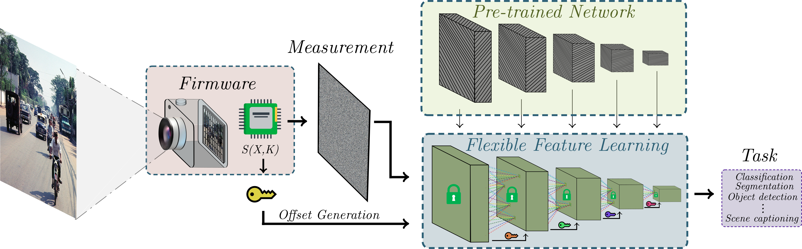

<p align="center">
  <h1 align="center">Privacy-Preserving Deep Learning Using Deformable Operators for Secure Task Learning</h1>
  <p align="center">
    
  <p align="center">
    <a href="https://github.com/Factral/" rel="external nofollow noopener" target="_blank"><strong>Fabian Perez</strong></a>
    ·
    <a href="https://scholar.google.com/citations?user=d1QOBbYAAAAJ&hl=en&oi=sra" rel="external nofollow noopener" target="_blank"><strong>Jhon Lopez</strong></a>
    ·
    <a href="https://scholar.google.com/citations?user=R7gjbGIAAAAJ&hl=en&oi=ao" rel="external nofollow noopener" target="_blank"><strong>Henry Arguello</strong></a>
    
  </p>
<p align="center">
    <a href="https://ieeexplore.ieee.org/document/10446218" rel="external nofollow noopener" target="_blank">ICASSP 2024 Paper</a>


## Oveview

In the era of cloud computing and data-driven applications, it is crucial to protect sensitive information to maintain data privacy, ensuring truly reliable systems. As a result, preserving privacy in deep learning systems has become a critical concern. Existing methods for privacy preservation rely on image encryption or perceptual transformation approaches. 

However, they often suffer from reduced task performance and high computational costs. To address these challenges, we propose a novel **Privacy-Preserving framework that uses a set of deformable operators for secure task learning**. Our method involves shuffling pixels during the analog-to-digital conversion process to generate visually protected data. Those are then fed into a well-known network enhanced with deformable operators. Using our approach, **users can achieve equivalent performance** to original images without additional training using a secret key.

Moreover, our method enables access control against unauthorized users. Experimental results demonstrate the efficacy of our approach, showcasing its potential in cloud-based scenarios and privacy-sensitive applications.


## Results

To validate the privacy protection of
our approach, we evaluated the performance of the shuffled
images for the classification task on the CIFAR-10 dataset

<div align="center">

| Experiment                 | Accuracy (%) |
|----------------------------|:------------:|
| Non-privacy                | **94.1**         |
| Pre-trained                | 11.7         |
| Fine-tuning                | 57.6         |
| our method with key        | **94.1**         |
| our method without key     | 11.8         |

</div>

Also, we evaluated our per-formance of the proposed approach using a PreResNet-110 adapted to our method compared to state-of-the-art techniques for private image classification.


<div align="center">

| Method   | Model         | # Parameters (10^6) | Acc   |
|----------|---------------|:-------------------:|-------|
| ELE  | Shakedrop     | 29.31               | 83.06 |
| EtC  | Shakedrop     | 5.35                | 89.09 |
| PrivConv  | ConvMixer-512/16 | 5.35         | 92.65 |
| Ours     | PreResNet-110 | 1.70                | **95.06** |

</div>

## Code Structure Explanation

The codebase is structured as follows:

- `checkpoints/`: This directory is used to store model checkpoints during training

- `experiments/`: Contains subdirectories for different experiments like classification and segmentation.
  - `classification/`: Includes configuration files (`conf.py`), inference script (`inference.py`), and training and testing scripts for CIFAR-10 dataset (`train_cifar10.py`, `test_cifar10.py`).
  - `segmentation/`: Includes the same files as the classification directory but for segmentation tasks. *will be added soon*

- `models/`: Contains model definitions.
  - `vgg.py`: Standard VGG model.
  - `vgg_deformable.py`: VGG model with deformable layers.

- `operators/`: Includes custom layers or functions like deformable pooling, offset calculations, and scramblers.
  - `deformable_pooling.py`: Deformable pooling layer.
  - `offset.py`: Offset calculation for deformable layers.
  - `scrambler.py`: Pixel scrambler for images

- `utils/`: Utility functions for training and other tasks.
  - `utils.py`: General utility functions.
  - `utils_train.py`: Utilities specific to training processes.


## Installation

To set up the environment for running the experiments, please follow these steps:

```bash
git clone https://github.com/Factral/PrivDL
cd PrivDL
pip install -r requirements.txt
```

## Usage

To train a model on classification, run the following command

*Non-privacy training*
```bash
python3 train_cifar10.py -net "vgg16" -dataset "cifar10" -epochs 200 -save_weights -gpu
```

*Privacy training*
```bash
python3 train_cifar10.py -net "vgg16" -dataset "cifar10" -epochs 200 -permute -save_weights -gpu
```

To test a model on classification, run the following command:

*Non-privacy testing*
```bash
python3 test_cifar10.py -net "vgg16" -dataset "cifar10" -b 64 -seed 1312 -weights 'path-to-weights' 
```

*Privacy testing*
```bash
python3 test_cifar10.py -net "vgg16_permuted" -dataset "cifar10" -permute -b 64 -seed 1312 -weights 'path-to-weights'
```

To run inference on a single image, run the following command:

*Non-privacy inference*
```bash
python3 inference.py -net "vgg16" -weights 'path-to-weights' -image 'path-to-image'
```

*privacy inference*
```bash
python3 inference.py -net "vgg16_permuted" -permute -weights 'path-to-weights' -image 'path-to-image'
```

## Citation

If you find this work useful, please consider citing our paper:

```bibtex
@INPROCEEDINGS{10446218,
  author={Perez, Fabian and Lopez, Jhon and Arguello, Henry},
  booktitle={ICASSP 2024 - 2024 IEEE International Conference on Acoustics, Speech and Signal Processing (ICASSP)}, 
  title={Privacy-Preserving Deep Learning Using Deformable Operators for Secure Task Learning}, 
  year={2024},
  volume={},
  number={},
  pages={5980-5984},
  keywords={Deep learning;Training;Privacy;Cloud computing;Encryption;Computational efficiency;Task analysis;Computational Imaging;Deformable Operators;Image Privacy;Image Encryption},
  doi={10.1109/ICASSP48485.2024.10446218}}
```
